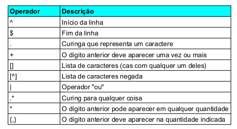
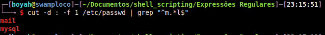
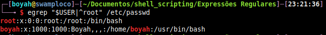

# Expressões Regulares no shell bash do linux
Sites para treinar _**regex**_

> [RegexPal](https://www.regexpal.com)

> [Pythex](https://pythex.org)

- **Metacaracteres** - caracteres que possuem significado especial
  - Transforma caracteres literais (comuns) em expressões de busca

### São os Seguintes:

```
\ . * + - { } [ ] ^ $ | ? ( ) : ! =
```

- Os **metacaracteres** podem ter mais de um significado, dependendo do contexto de uso.

> Obs: Aspas **NÃO** são **metacaracteres**



- _**[Link do TerminalRoot com vários comandos de regex com grep e egrep](https://terminalroot.com.br/2015/01/shell-script-validandotele.html)**_

## Praticando

- Grupos que **começam** com a letra _**"r"**_ no arquivo **/etc/group**

>     $ cut -d : -f 1 /etc/group | grep "^r"

- Grupos que **terminem** com a letra _**"t"**_

>     $  cut -d : -f 1 /etc/group | grep "t$"

- Grupos que **comecem** com a letra _**"r"**_ e terminem com a letra _**"t"**_

>     $ cut -d : -f 1 /etc/group | grep "^r.*t$"

- Grupos que **terminam** com a letra _**"e"**_ ou _**"d"**_

>     $ cut -d : -f 1 /etc/group | grep "[ed]$"

-  Grupos que **não terminam** com a letra _**"e"**_ ou _**"d"**_

>     $ cut -d : -f 1 /etc/group | grep "[^ed]$"

- Grupos que **começam** com **qualquer dígito** e a **segunda** letra seja um _**"u"**_ ou _**"d"**_

> 	  $ cut -d : -f 1 /etc/group | grep "^.[ud]"

- Grupos que tenha seu nome de **2 a 4** dígitos de tamanho

>	  $ cut -d : -f 1 /etc/group | egrep "^.{2,4}$"

- Grupos que comecem com _**"r"**_ ou _**"s"**_ **`(use o operador OR)`**

> 	  $ cut -d : -f 1 /etc/group | egrep "^[r|^s]"

---

----------------------------------------------------------------------
 _**Bonus:**_




-----------------------------------------------------------------------