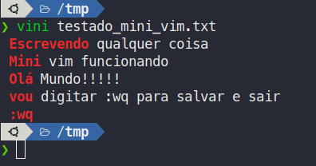

## Comandos Úteis ou Interessantes para Shell Script

### 01. Procurar um arquivo e já abrir assim que encontrá-lo

- Caso você tenha esquecido onde guardou um arquivo ou um arquivo gerado pelo sistema e você deseja encontrá-lo e já abrir automaticamente o **-exec** pode lhe ajudar, exemplo:

```
sudo find /var/log/ -name "teste.log" -exec vim {} \;
```

- Ou se quiser já removê-lo:

```
find ~/Downloads/ -name "iziToast-master (1).zip" -exec rm {}\;
```

- Ou até mesmo copiá-lo para seu diretório pessoal

```
sudo find /var/log -name "teste.log" -exec cp {} /tmp/. \;
```

- Otmizar Imagens

```
find /assets/img -name "*.jpg" -exec jpegoptim -f --size=42% {} . \;
```

## 02. Insira um relógio no canto superior esquerdo do terminal

```
while sleep 1;do tput sc;tput cup 0 $(($(tput cols)-29));date;tput rc;done &
```

## 03. Rode seu último comando rapidamente

```
!! ou
sudo !!
```

## 04. Vim Bash

- Já pensou em fazer um Mini Vim digitar conteúdo direto no prompt ?

```
PS2=" ";alias vini="cat <<:wq >> $1"
```


## 05. Colunas Lado a lado


## 07. Gerar uma senha forte rapidamente

```
date | md5sum | awk '{print $1}'
```